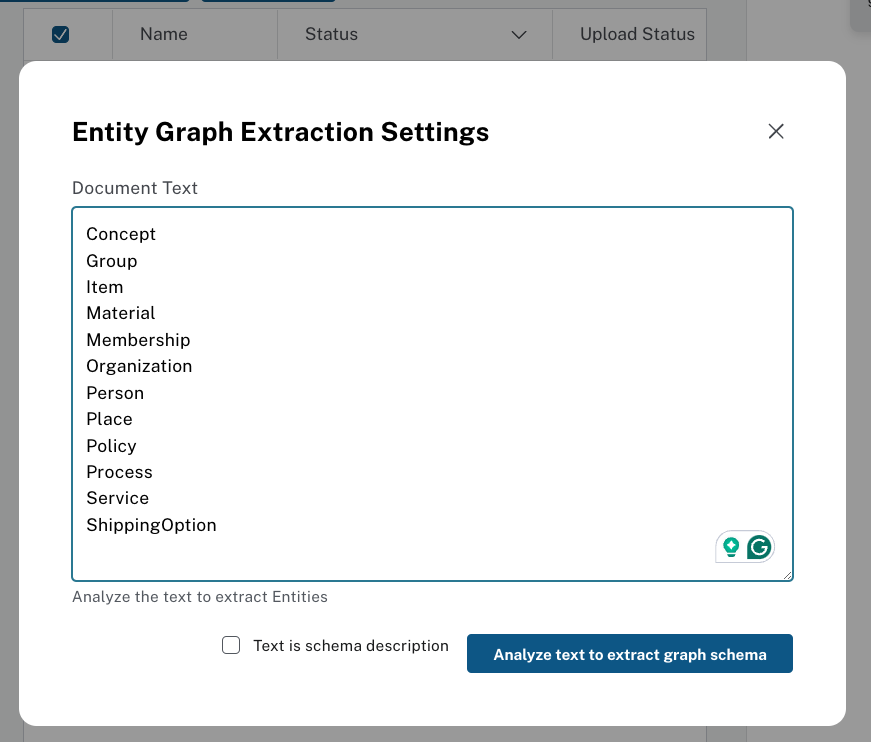
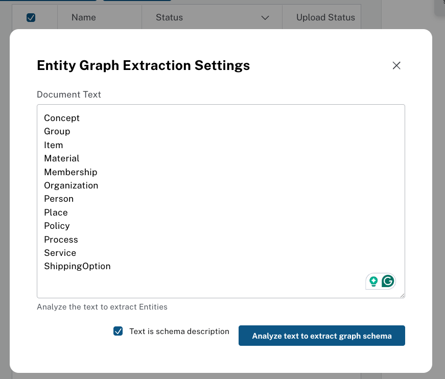
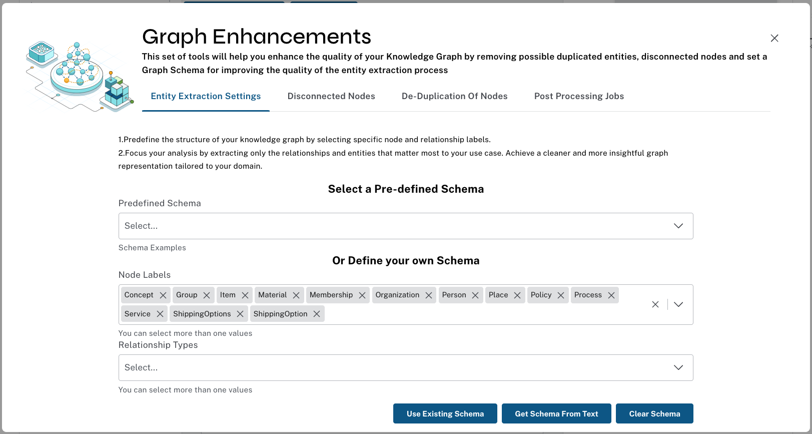
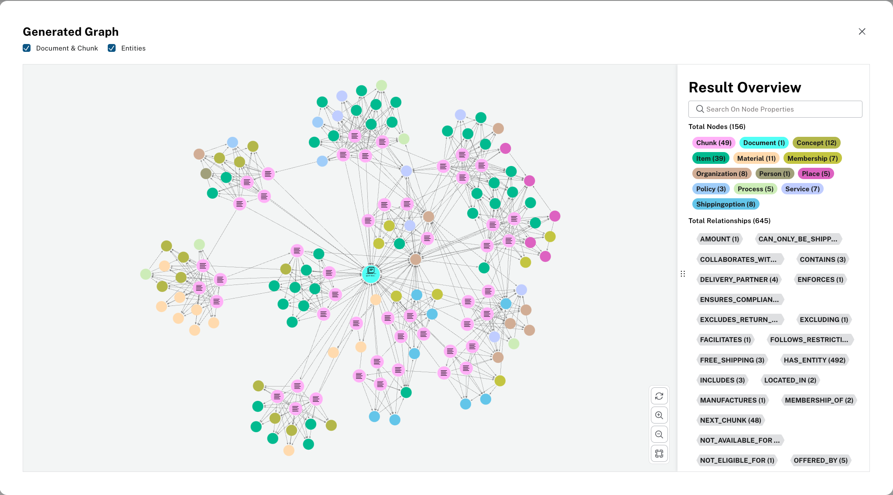

# GraphRAG Customer Experience Example

AN example application demonstrates how to implement GraphRAG for various touchpoints in the customer journey including:

1. __Discovery__: Improve click-through rate with personalized marketing
2. __Search__: Increase conversion with tailored semantic search
3. __Recommendations__: Boost average order value with customized recommendations
4. __Support__: Reduce cost to serve with well-grounded, fact-based, AI scripts

The app focuses on a retail example using the [H&M Personalized Fashion Recommendations Dataset](https://www.kaggle.com/competitions/h-and-m-personalized-fashion-recommendations/data), a sample of real customer purchase data that includes rich information around products including names, types, descriptions, department sections, etc. 

This project contains the following services wrapped as docker containers
1. **API**: Uses LangChain (with LangServ) to retrieve data from Neo4j and call OpenAI LLM & embedding models.
2. **UI**: Simple streamlit user interface. Available on `localhost:8501`.


## Running The App

### Prerequisites

1. [Docker](https://docs.docker.com/engine/install/)
2. [OpenAI API Key](https://platform.openai.com/docs/quickstart/account-setup)

### Setup

create a `.env` file with the below. Fill in your OpenAI API key. To get started you can use our pre-populated graph database at `neo4j+s://b5d4f951.databases.neo4j.io`. To construct the graph yourself from source data using your own Neo4j DB, follow the directions in [Data Loading](#data-loading).

```
#Neo4j
NEO4J_URI=neo4j+s://b5d4f951.databases.neo4j.io
NEO4J_USERNAME=retail
NEO4J_PASSWORD=pleaseletmein
NEO4J_DATABASE=neo4j

#OpenAI
OPENAI_API_KEY=<YOUR_OPENAI_API_KEY>

# Other
# change to public IP address if deploying remotely
ADVERTISED_ADDRESS="http://localhost"
```

### Run
To start the app, run the following command:
```
docker-compose up
```

To start and rebuild, after changing env variables or code, run
```
docker-compose up --build
```

To stop the app, run

```
docker-compose down
```

Open `http://localhost:8501` in your browser to interact with the app.


## Data Loading

Constructing the complete knowledge graph requires [creating your own AuraDS instance](https://neo4j.com/docs/aura/aurads/create-instance/) or using another Neo4j database deployment such as Desktop, Sandbox, Server or Docker with [Graph Data Science (GDS) installed](https://neo4j.com/docs/graph-data-science/current/installation/). 

There are two components to the graph that need to be loaded:  the __Product Graph__ & __Support Graph__:

### Product Graph Loading
For the product graph powering Discovery, Search, and Recommendations pages use [this notebook](https://github.com/neo4j-product-examples/graphrag-examples/blob/main/load-data/hm-data.ipynb) to load data. This leverages the [H&M Personalized Fashion Recommendations Dataset](https://www.kaggle.com/competitions/h-and-m-personalized-fashion-recommendations/data), a sample of real customer purchase data that includes rich information around products including names, types, descriptions, department sections, etc.

Below is the end result graph data model:


### Support Graph Loading
To power the support page, use the [LLM Graph Builder](https://neo4j.com/labs/genai-ecosystem/llm-graph-builder/) to construct a graph from a source PDF document. Specifically,
1. Go to the LLM graph builder [online application](https://llm-graph-builder.neo4jlabs.com/)
2. Connect to the same database used for loading the Product graph
3. Load [this pdf document](https://drive.google.com/file/d/1Ec1vaKlcySmF24JGJqhHfRwvEBdcZ7EZ/view?usp=sharing) via the "Drag & Drop" box in the upper left-hand corner.  This pdf consists of scrapped web information replicating customer support and FAQ details from the H&M website. links and some brand names have been replaced with dummy links/names
4. Add a graph schema.  This is best practice when building graphs from unstructured text.  For this example we will just define node labels to use, but in real-world examples you may need to define relationship types as well. 
   1. Click the "Graph Enhancement" button then the "Get Schema From Text" button.  
   2. Copy the text from the [`support-node-labels.txt`](support-node-labels.txt) file and past in the box.
   
   
   3. check off the "text is schema description" box and press the "Analyze text to extract graph schema" button.
   
   
   4. When complete, you should have a schema that looks like the below
   
   
   5. Close the Graph Enhancements window

5. Click the "Generate Graph" button and wait for completion
6. When you press "Preview Graph" you should get something that looks like the below


After completing both data loading components above, you can run the app following the directions in the [Running the App](#running-the-app) section.



## Databricks / Spark Loading Scripts
*\[TODO\]: Update to most recent schema and source files to work with demo.*

See [here](https://github.com/neo4j-product-examples/ds-spark-examples/tree/main/spark-databricks-delta-lake) for scripts to stage & load H&M data from Databricks.


## Deploying in the Cloud

These directions are written for GCP VMs but should be repeatable with minor changes on other cloud providers.

### 1 Create Instance
* Create a Google Cloud VM instance. Make sure the boot disk is large enough. 10GB is not enough. 100GB works well in testing
* Create firewall rules to allow traffic on ports 8080 and 8501
* If you didn't increase boot disk size when creating the instance resize the disk now with the following command (often defaults to 10GB disk which will cause problems).
`gcloud compute disks resize <boot disk name> --size 100`
Then restart the instance for the boot disk change to take effect

### 2 Setup & Config
Easiest with root access for demo purposes, so first:

    sudo su

Then you'll need to install git and clone this repo:

    apt install -y git
    mkdir -p /app
    cd /app
    git clone https://github.com/neo4j-product-examples/graphrag-customer-experience.git
    cd graphrag-customer-experience

Let's install python & pip:

    apt install -y python
    apt install -y pip

Now, install docker [per these directions](https://docs.docker.com/engine/install/debian/#install-using-the-repository)

Then install docker-compose
    
    apt install docker-compose

Now update the configs in a `.env` file as documented above in the [Setup](#setup)


### 3 Run
build and run the container with below command (the first time can take a while to build)

    docker-compose up

Optionally, you can run in a detached state to ensure the app continues even if you disconnect from the vm instance:

    docker-compose up -d

To stop the app run

    docker-compose down

## Contributions

Contributions are welcome!